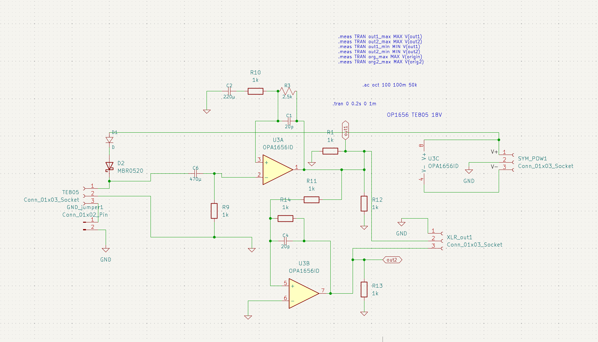
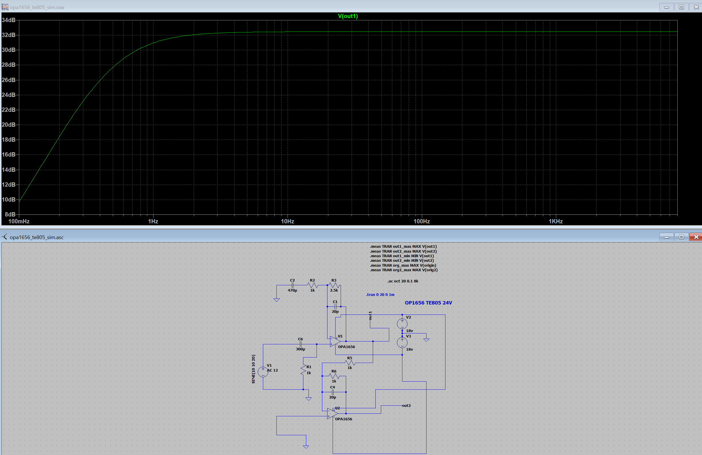

# Amplifier for sci-art project "intangible-resonances"
Signal Amplifier design for the sci-art installation "Intangible Resonances"

This amplifier is specifically designed for the TE805 Piezoelectric Accelerometer to convert its output into an audio signal for further processing. The objective is to measure building vibrations (approximately 1–2000 Hz) in real time.

 Professional building vibration measurement typically requires expensive, specialized equipment. Inspired by the research of Dolezal et al. (2024), this project utilizes an Integrated Electronics Piezo-Electric (IEPE) accelerometer coupled with a sound interface.

The TE805 was selected for its wide frequency response (1–8000 Hz) and its operating voltage range. The circuit schematic was designed in KiCAD, and simulations were built in LTspice to determine the optimal amplification bandwidth(1Hz<).

**Key Components:**

Accelerometer: TE Connectivity TE805 ([Link](https://www.te.com/en/product-805-0050.html))

Op-amp: TI OPA1656 ([Link](https://www.ti.com/product/OPA1656))

**References:**

Project: Intangible Resonances
https://ahonda.org/Artworks/intangible-resonances

Study: Dolezal, F.; Reichenauer, A.; Wilfling, A.; Neusser, M.; Prislan, R. Recording, Processing, and Reproduction of Vibrations Produced by Impact Noise Sources in Buildings. _Acoustics_ 2024, _6_, 97-113. https://doi.org/10.3390/acoustics6010006

Schematic

Simulation

